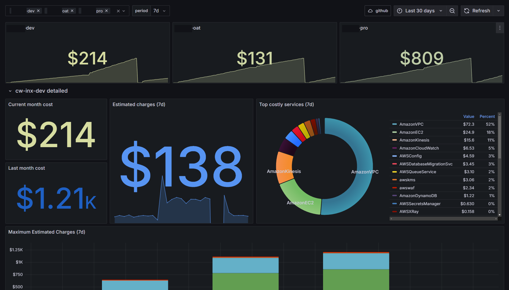
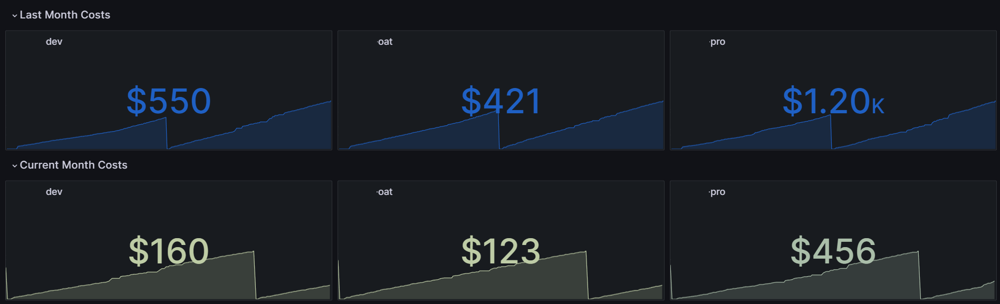
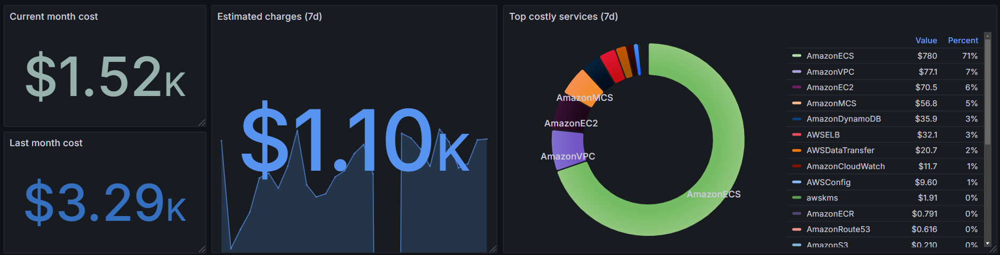
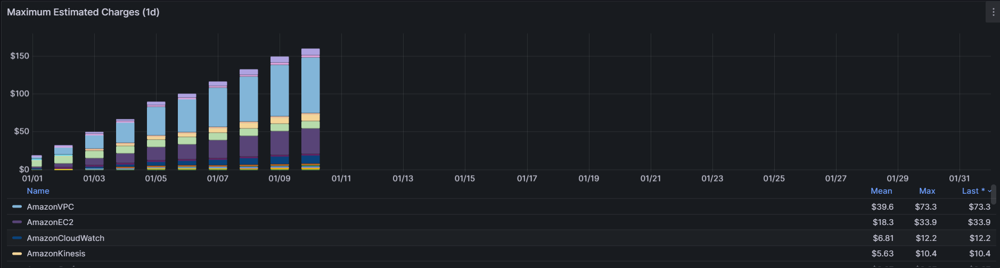

# Billing

This dashboard displays cost for multiple aws account.

# Multi datasource/aws account stats
## Last month vs Current month

## Detailed view per account

## FAQ

References: 

- [Billing Alarm and region](https://docs.aws.amazon.com/AmazonCloudWatch/latest/monitoring/monitor_estimated_charges_with_cloudwatch.html#creating_billing_alarm_with_wizard)

Why the cloudwatch region is us-east-1 ?

> "you must set your Region to US East (N. Virginia). Billing metric data is stored in this Region and represents worldwide charges"