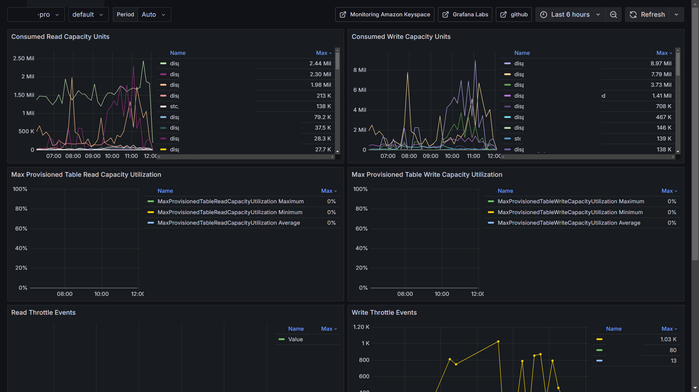

# Keyspaces / Cassandra

Reference: https://docs.aws.amazon.com/keyspaces/latest/devguide/monitoring-cloudwatch.html

This dashboard integrates all aws recommendations

## Consumed Read Capacity

## Consumed Write Capacity

## Read Throttle Events

## Write Throttle Events

## Per Connection Request Rates

