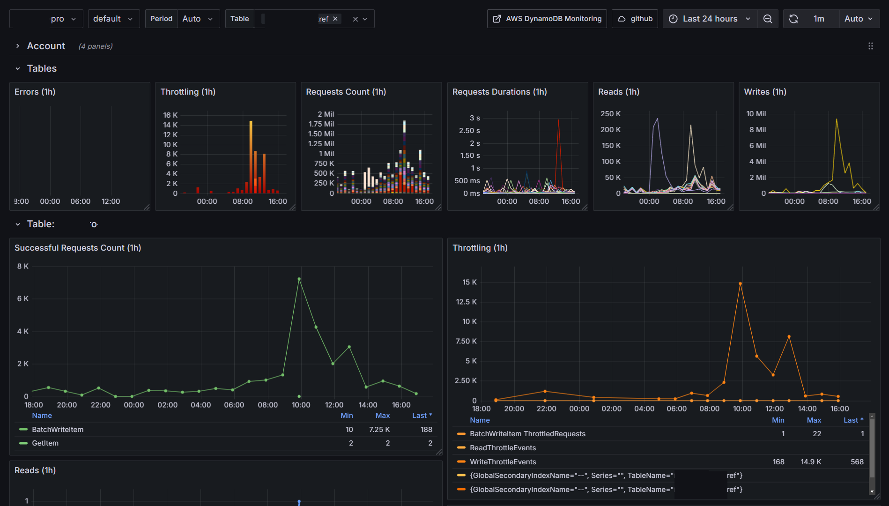

# DynamoDB

Reference: https://docs.aws.amazon.com/amazondynamodb/latest/developerguide/Monitoring-metrics-with-Amazon-CloudWatch.html

DynamoDB, Kinesis Data Streams, DynamoDB Streams metrics and Global Table metrics.

## Tables metrics
A header graphs which display important metrics for all tables in the account (datasource)

## Table metrics

### Errors / Throttles / Rates / Durations

### Table and Global Secondary Indexes Reads / Write

## Account metrics
DynamoDB is a SAAS product from AWS and comes with quotas and rate limiting.

