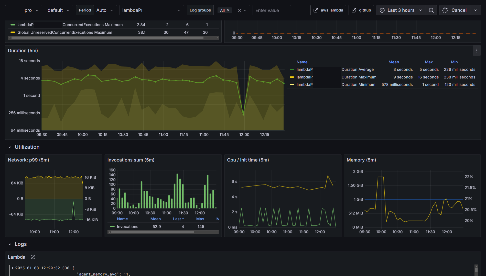
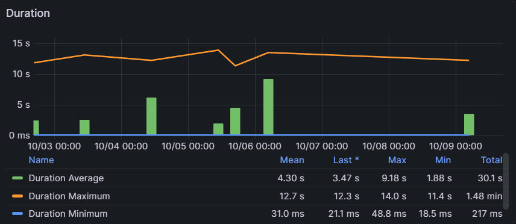
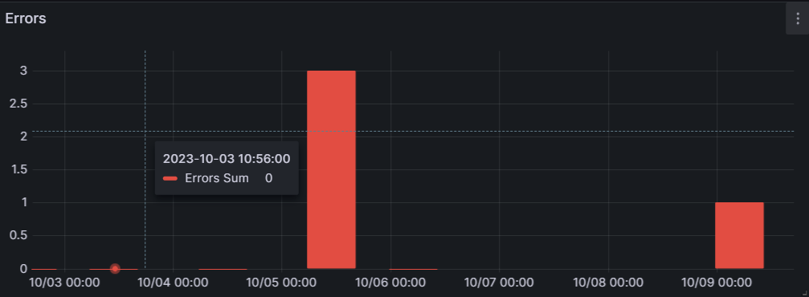
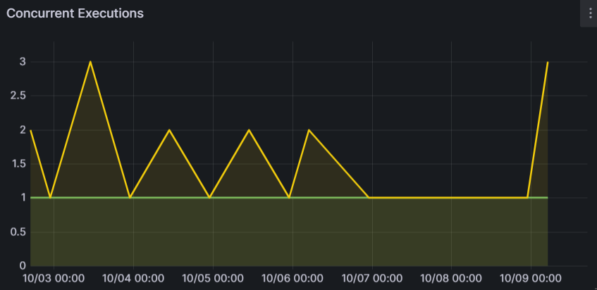
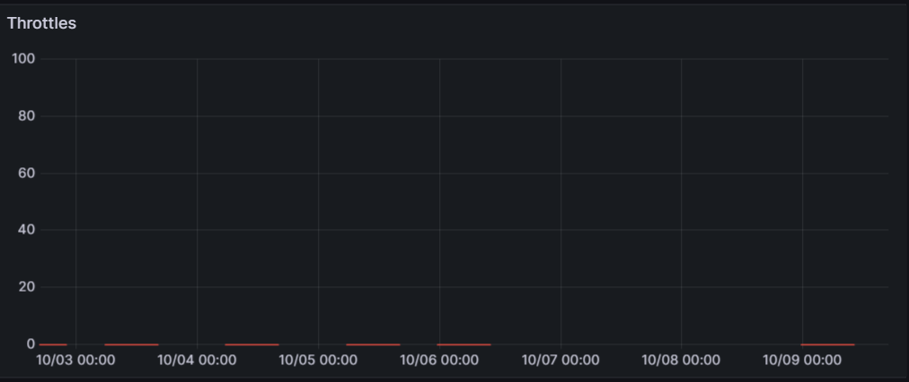
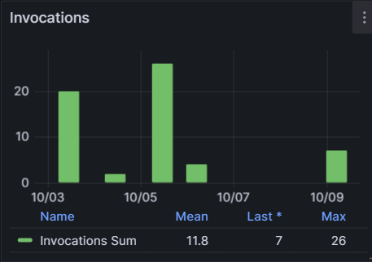
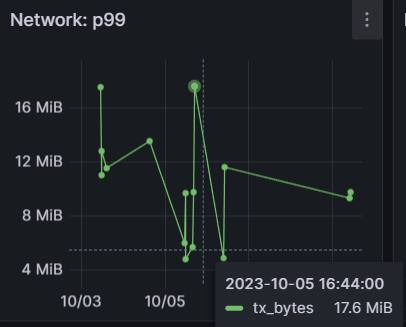
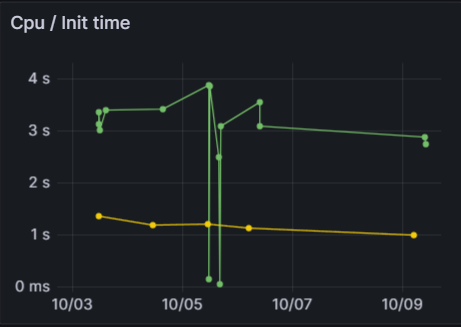
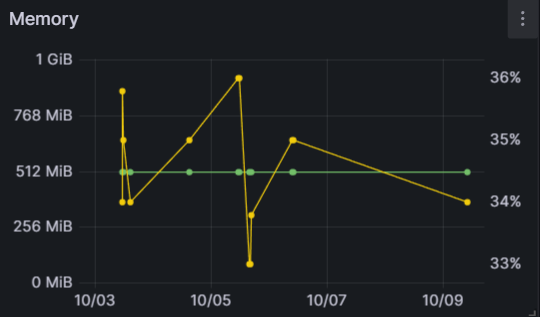

# AWS Lambda / Lambda Insights

Reference: https://docs.aws.amazon.com/lambda/latest/dg/monitoring-insights.html

This dashboard uses aws lambda and lambda insights namespace by using the [use method](https://www.brendangregg.com/usemethod.html)

## Duration

## Errors

## Concurrent Executions

## Throttles

## Invocations

## Network

## CPU / Init time

## Memory
