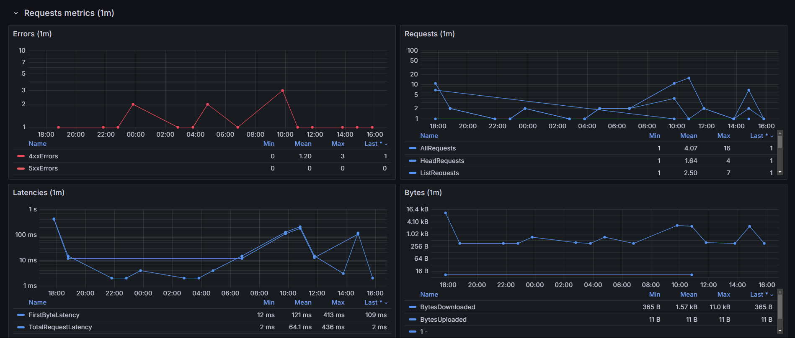

# S3

Reference: https://docs.aws.amazon.com/AmazonS3/latest/userguide/cloudwatch-monitoring.html

Daily storage, Requests, Replication and Object Lambda request metrics.

## Daily storage metrics
These storage metrics for Amazon S3 are reported once per day.

Reference: https://docs.aws.amazon.com/AmazonS3/latest/userguide/cloudwatch-monitoring.html

## Requests metrics
These metrics are not activated by default. See the reference to enable it (pay attention that these metrics will be charged).

Reference: https://docs.aws.amazon.com/AmazonS3/latest/userguide/configure-request-metrics-bucket.html

