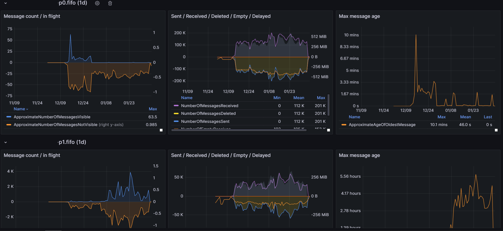
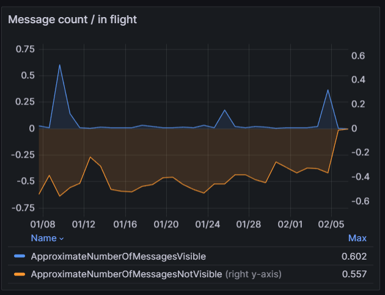
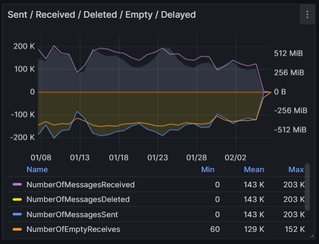
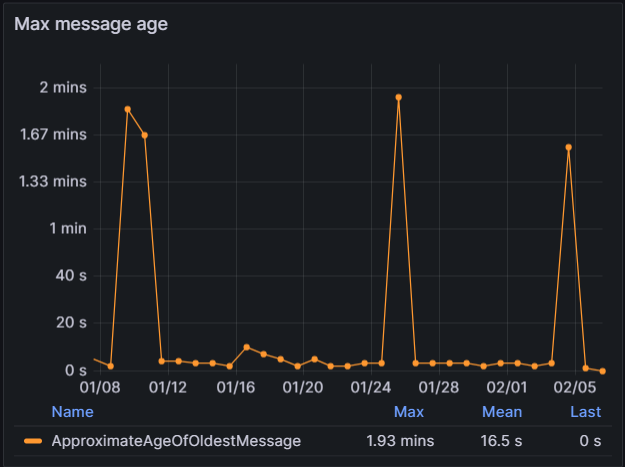

# AWS SQS

Reference: https://docs.aws.amazon.com/AWSSimpleQueueService/latest/SQSDeveloperGuide/sqs-available-cloudwatch-metrics.html

This dashboard uses aws sqs namespace cloudwatch metrics

## Multiple queue monitoring

## Message count / In Flight

## Message Sent / Received / Size

## Max Message Age
