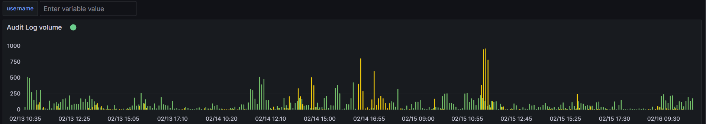
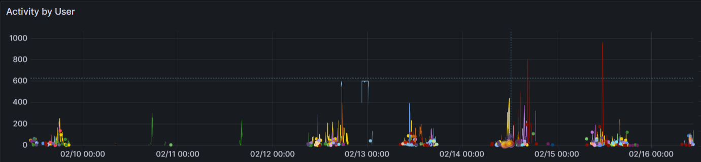
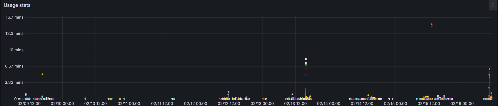

# GrafanaCloud Monitoring / Audit log

This dashboard helps to monitor activity by user for security reason and is useful for companies needing audit logs for security purpose.

It is useful to understand the activity and identify abuse of usage to quickly fix usage / quota and best practices.

## Audit log volume

## Audit log by user

## Usage Stats
