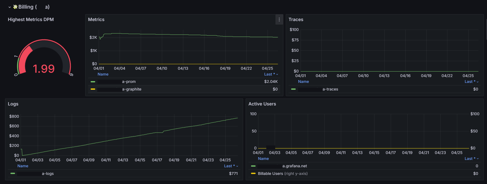

# GrafanaCloud Monitoring / Billing / Usage

This dashboard helps GrafanaCloud admin to monitor telemetry rate limiting, drops and errors to increase quotas for GrafanaCloud.

## Alerting

## Billing per tenant

## Billing usage

## Saturation

## Errors

## Top Dashboard
