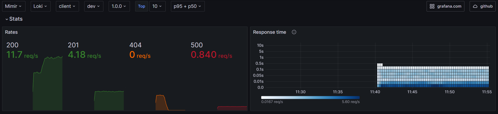

# OpenTelemetry dotnet webapi

OpenTelemetry dotnet webapi dashboard using [RED method](https://grafana.com/blog/2018/08/02/the-red-method-how-to-instrument-your-services/)

## Blog post with live demo
A complete [live demo](https://github.com/o11y-weekly/o11y-weekly.github.io/tree/main/2024-02-28_OpenTelemetry_Looks_Good_To_Me_dotnet) and [blog post](https://o11y-weekly.github.io/2024-02-28_OpenTelemetry_Looks_Good_To_Me_dotnet/) with docker compose is available at [github](https://github.com/o11y-weekly/o11y-weekly.github.io/tree/main/2024-02-28_OpenTelemetry_Looks_Good_To_Me_dotnet).

## Stats


## RED


## Metrics to traces


## HTTP Server


## Process


## Runtime


## HTTP Client


## Logs


## Setup dotnet dependencies
```bash
dotnet add package OpenTelemetry.Exporter.OpenTelemetryProtocol
dotnet add package OpenTelemetry.Instrumentation.AspNetCore
dotnet add package OpenTelemetry.Instrumentation.Http
dotnet add package OpenTelemetry.Instrumentation.Runtime
dotnet add package System.Diagnostics.DiagnosticSource
dotnet add package OpenTelemetry.Instrumentation.Process
```