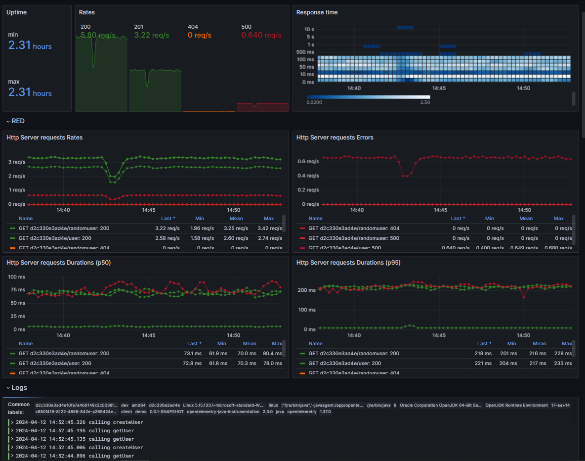
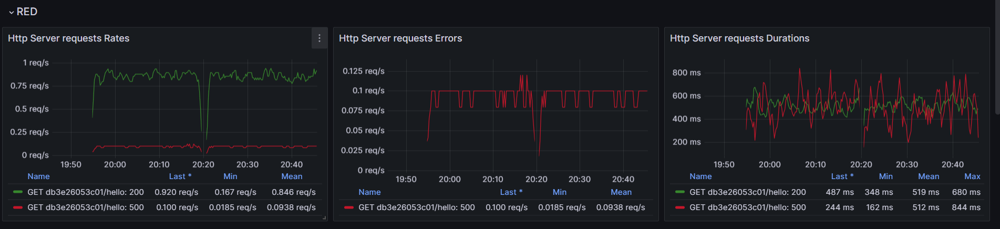
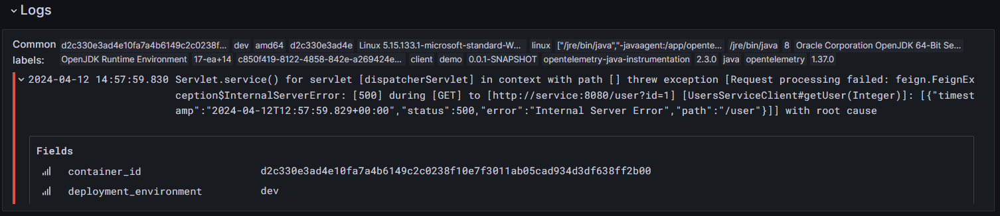
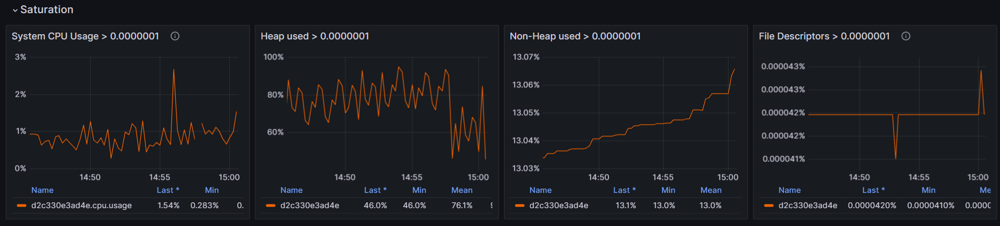
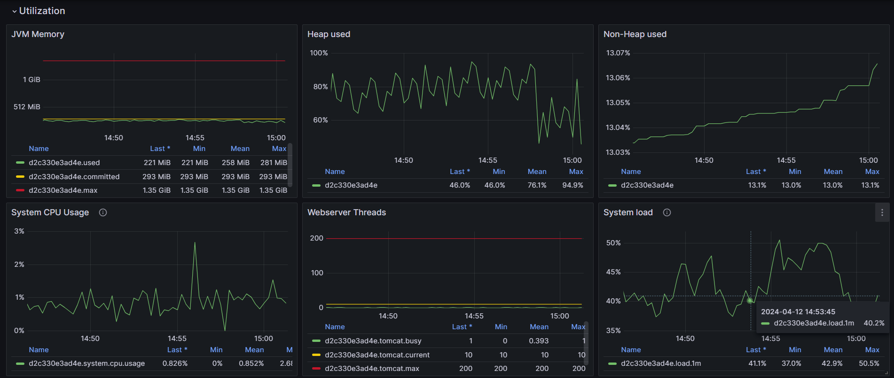
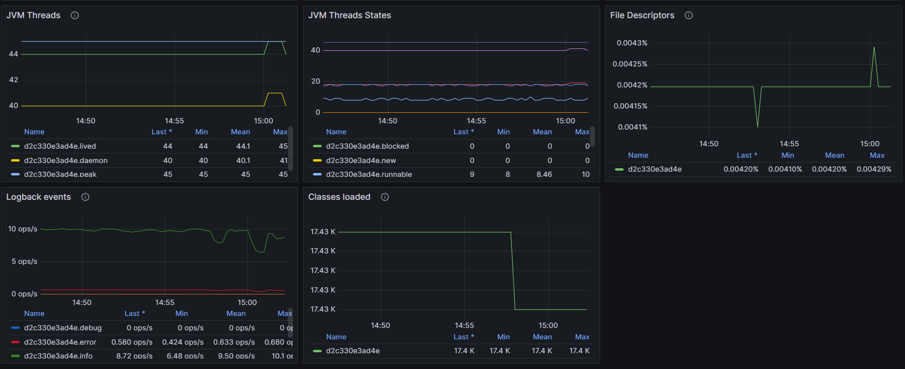
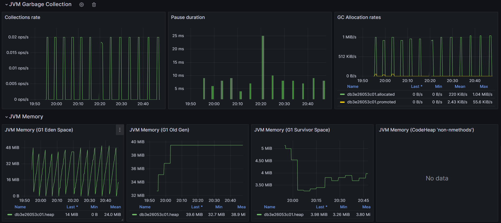
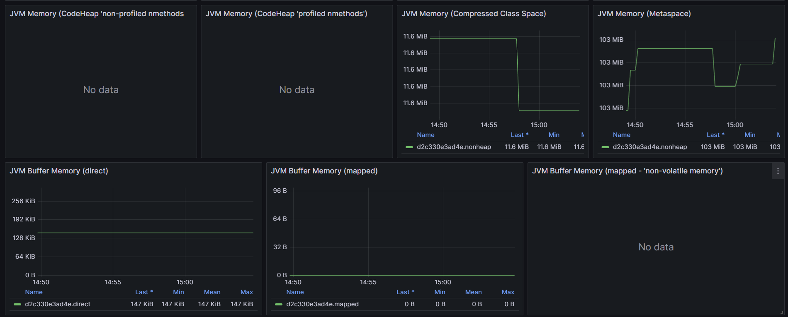

# OpenTelemetry JVM Spring Boot dashboard

Metrics are sent via micrometer-otlp.
Logs are sent via the opentelemetry exporter.

This dashboard has been built by following:
- [USE method by Brendan Gregg](https://www.brendangregg.com/usemethod.html#:~:text=The%20Utilization%20Saturation%20and%20Errors,identifying%20resource%20bottlenecks%20or%20errors.)
- [RED method](https://grafana.com/blog/2018/08/02/the-red-method-how-to-instrument-your-services/)

## Blog post with live demo
A complete [live demo](https://o11y-weekly.github.io/2024-01-31_OpenTelemetry_Looks_Good_To_Me/demo/) and [blog post](https://o11y-weekly.github.io/2024-01-31_OpenTelemetry_Looks_Good_To_Me/) with docker compose is available at [github](https://github.com/cboudereau/grafana-dashboards/tree/main/opentelemetry/java/springboot).

## Stats

## RED

## Logs

## Saturation

## Utilization (JVM)

## JVM Garbage Collection and Memory

