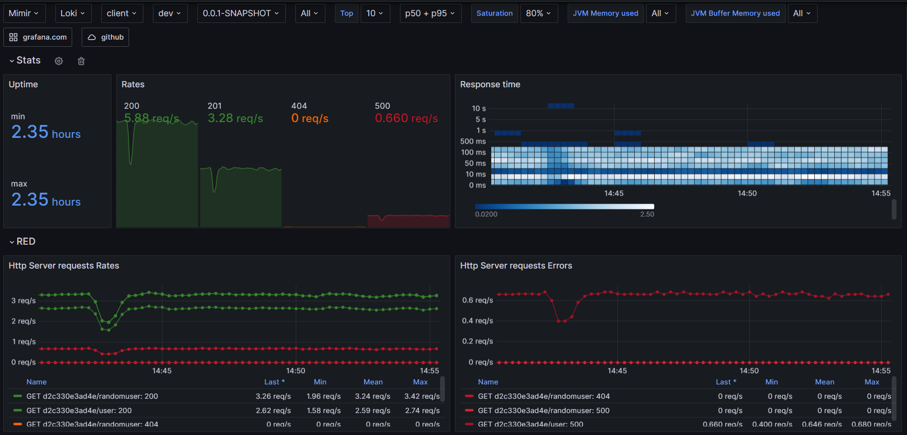
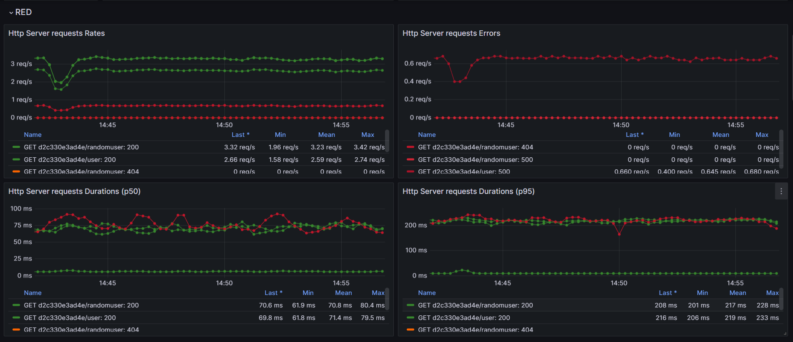
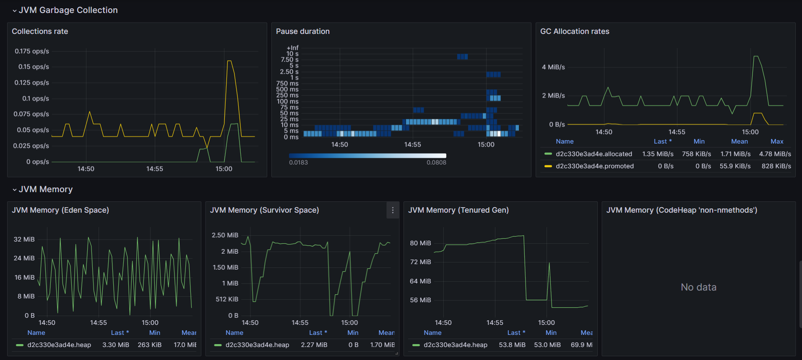

# OpenTelemetry JVM Spring Boot dashboard

Metrics are sent via micrometer-otlp.
Logs are sent via the opentelemetry exporter.

Those dashboards are availble at grafana.com:
 - [main dashboard](https://grafana.com/grafana/dashboards/20352)
 - [detailed dashboard (datalink support)](https://grafana.com/grafana/dashboards/20353)

This dashboard has been built by following:
- [USE method by Brendan Gregg](https://www.brendangregg.com/usemethod.html#:~:text=The%20Utilization%20Saturation%20and%20Errors,identifying%20resource%20bottlenecks%20or%20errors.)
- [RED method](https://grafana.com/blog/2018/08/02/the-red-method-how-to-instrument-your-services/)

Used datasources are [Mimir](https://grafana.com/oss/mimir/) and [Loki](https://grafana.com/oss/loki/) and a full demo is availble here: TODO

## Stats

## RED

## Saturation

## Utilization (JVM)

## JVM Garbage Collection and Memory

## Logs

