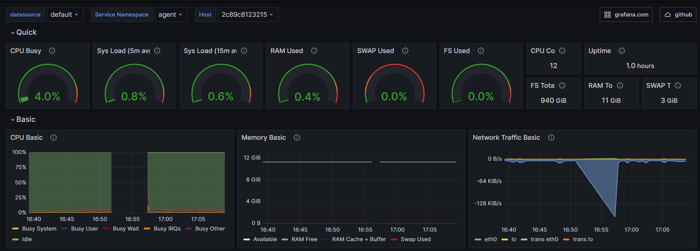
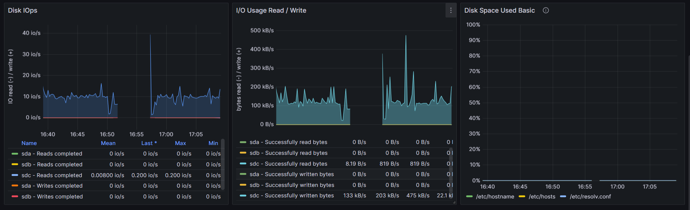
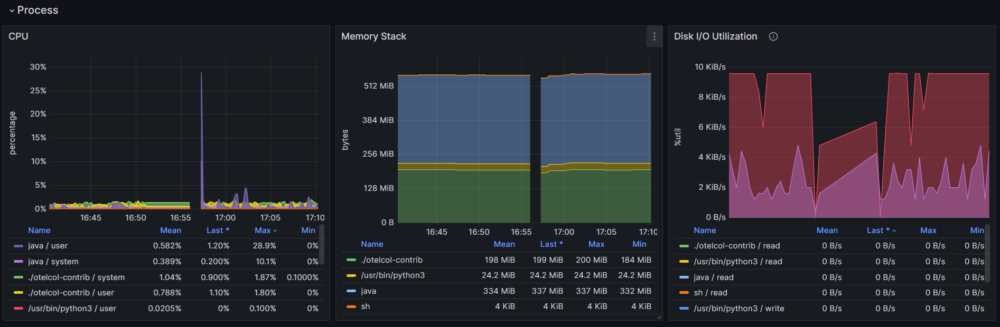

# OpenTelemetry Collector Contrib HostMetrics (Node Exporter)

## Description
otelcol-contrib hostmetrics (Node Exporter)

https://github.com/open-telemetry/opentelemetry-collector-contrib/tree/main/receiver/hostmetricsreceiver#host-metrics-receiver

This dashboard has been adapted for otel from node exporter: https://github.com/open-telemetry/opentelemetry-collector-contrib/tree/main/receiver/hostmetricsreceiver#host-metrics-receiver

## Quick and bacic views

## Process metrics

